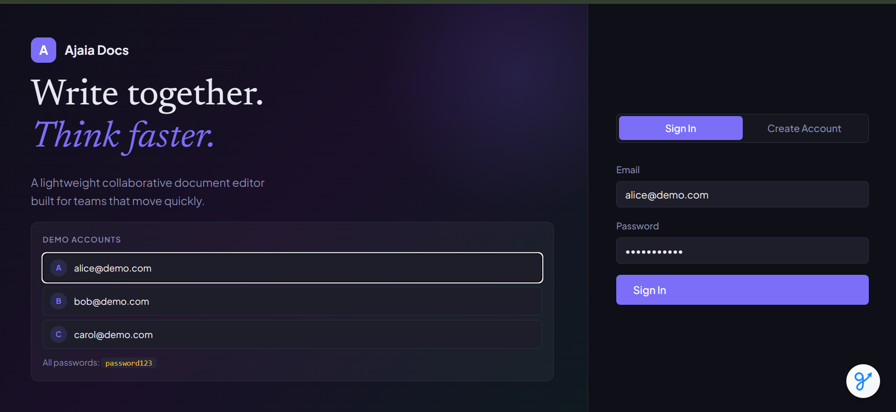
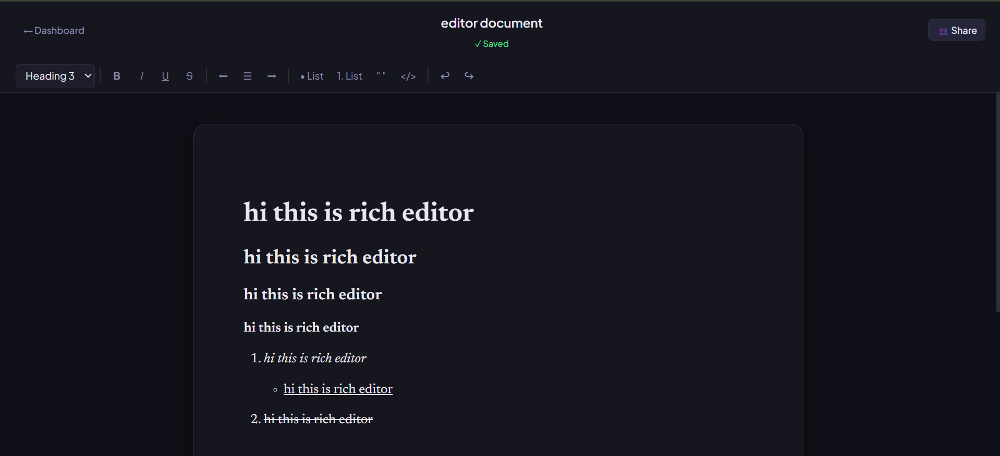
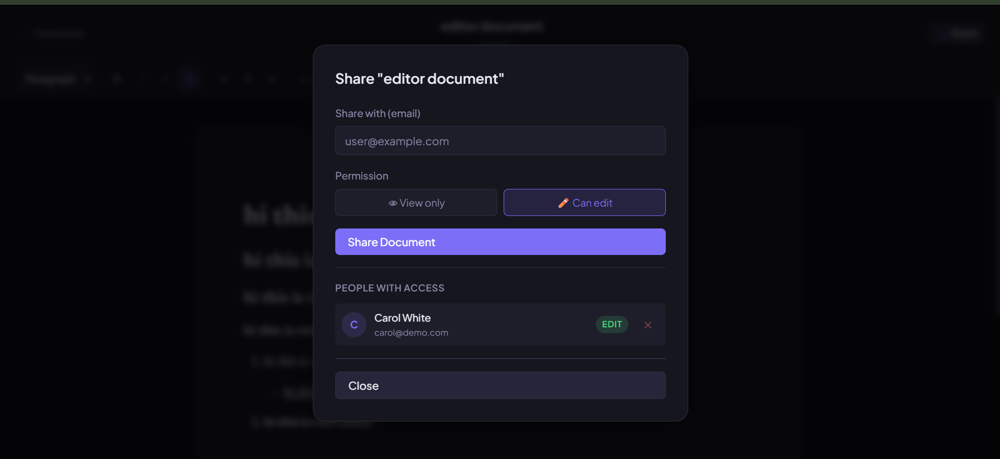
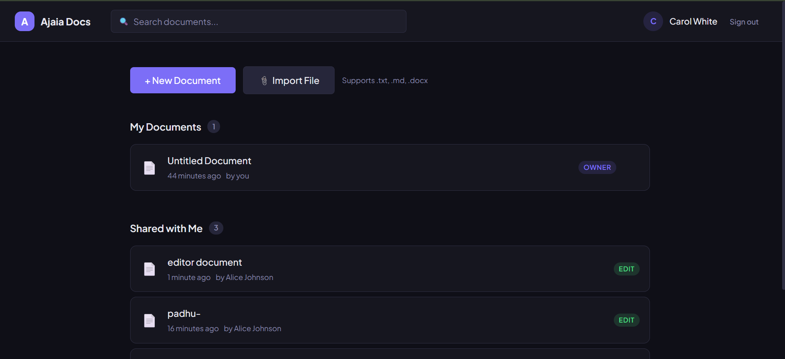
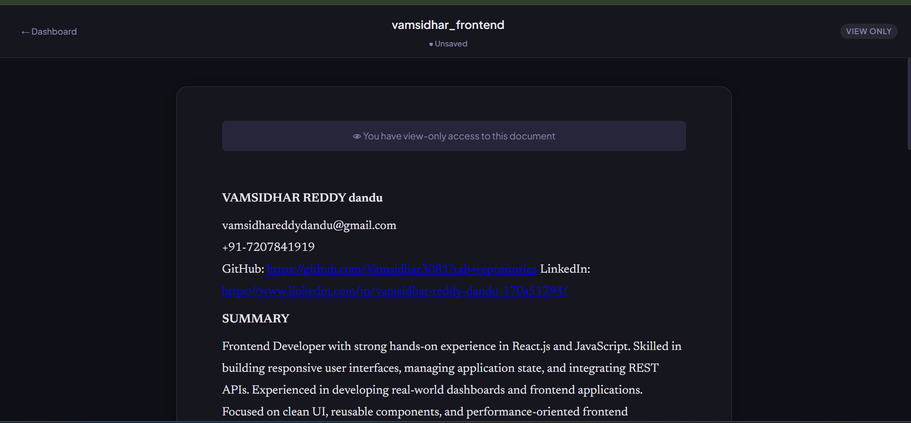

# Ajaia Docs — Collaborative Document Editor

A lightweight collaborative document editor with rich-text editing, file import, and document sharing.

---

## Screenshots

### Login Page
Demonstrates user authentication with demo accounts.



### Rich Text Editor
Supports headings, bold, italic, underline, lists, and autosave.



### Document Sharing
Share documents with other users using View or Edit permissions.



### Shared Documents Dashboard
Clearly separates owned documents from documents shared by others.



### View Only Permission
Users with view-only access can read content but cannot modify it.




## Quick Start (5 minutes)

### Prerequisites
- Node.js 18+ (check with `node --version`)
- npm 9+

### 1. Install dependencies

```bash
# From the root ajaia-docs folder:
cd backend && npm install
cd ../frontend && npm install
```

### 2. Start the backend

```bash
# In one terminal:
cd backend
npm start
# Server starts on http://localhost:3001
# Demo users are seeded automatically
```

### 3. Start the frontend

```bash
# In a second terminal:
cd frontend
npm start
# Opens http://localhost:3000 in your browser
```

### 4. Log in with a demo account

| Email | Password |
|-------|----------|
| alice@demo.com | password123 |
| bob@demo.com | password123 |
| carol@demo.com | password123 |

---

## Features

### ✅ Document Creation & Editing
- Create, rename, and delete documents
- Rich-text editor powered by TipTap/ProseMirror
- Formatting: Bold, Italic, Underline, Strikethrough
- Headings (H1/H2/H3), Paragraph styles
- Bullet lists, Numbered lists, Blockquotes, Code
- Text alignment (left, center, right)
- Autosave every 1.5 seconds after edits
- Manual save status indicator (Saved / Saving / Unsaved)

### ✅ File Upload / Import
- Drag or click to upload `.txt`, `.md`, or `.docx` files
- Converts file content into a new editable document
- Markdown files are converted to rich HTML
- DOCX files converted using Mammoth library
- 10MB file size limit

### ✅ Sharing
- Share any document you own via email address
- Two permission levels: **View only** or **Can edit**
- Shared documents appear in recipient's dashboard under "Shared with Me"
- Owner can remove access at any time
- Visual badge on each document: `owner`, `edit`, or `view`
- View-only users see a banner and cannot edit

### ✅ Persistence
- SQLite database (`backend/data.db`) — zero setup required
- Documents and sharing data persist across restarts
- Rich text HTML content preserved exactly

---

## Running Tests

```bash
# Start backend first, then in another terminal:
cd backend
npm test
```

Tests cover: health check, login, document CRUD, sharing, access control.

---

## Project Structure

```
ajaia-docs/
├── backend/
│   ├── server.js          # Express app entry
│   ├── db.js              # SQLite setup + seeding
│   ├── middleware/auth.js  # JWT middleware
│   ├── routes/
│   │   ├── auth.js        # Login, register, list users
│   │   ├── documents.js   # CRUD + file upload
│   │   └── shares.js      # Share management
│   └── tests/api.test.js  # Integration tests
├── frontend/
│   └── src/
│       ├── App.js
│       ├── context/        # Auth + Toast providers
│       ├── pages/          # Login, Dashboard, Editor
│       └── components/     # ShareModal
└── README.md
```

---

## Environment Variables (optional)

```bash
# backend/.env
PORT=3001
JWT_SECRET=your-secret-key
FRONTEND_URL=http://localhost:3000
```

---

## Supported File Types for Import

| Extension | Notes |
|-----------|-------|
| `.txt` | Plain text, each line becomes a paragraph |
| `.md` | Markdown converted to HTML (headings, bold, italic, lists) |
| `.docx` | Full Word document conversion via Mammoth |

Other file types will show an error message.

---

## Architecture Notes

See `ARCHITECTURE.md` for detailed design decisions.
